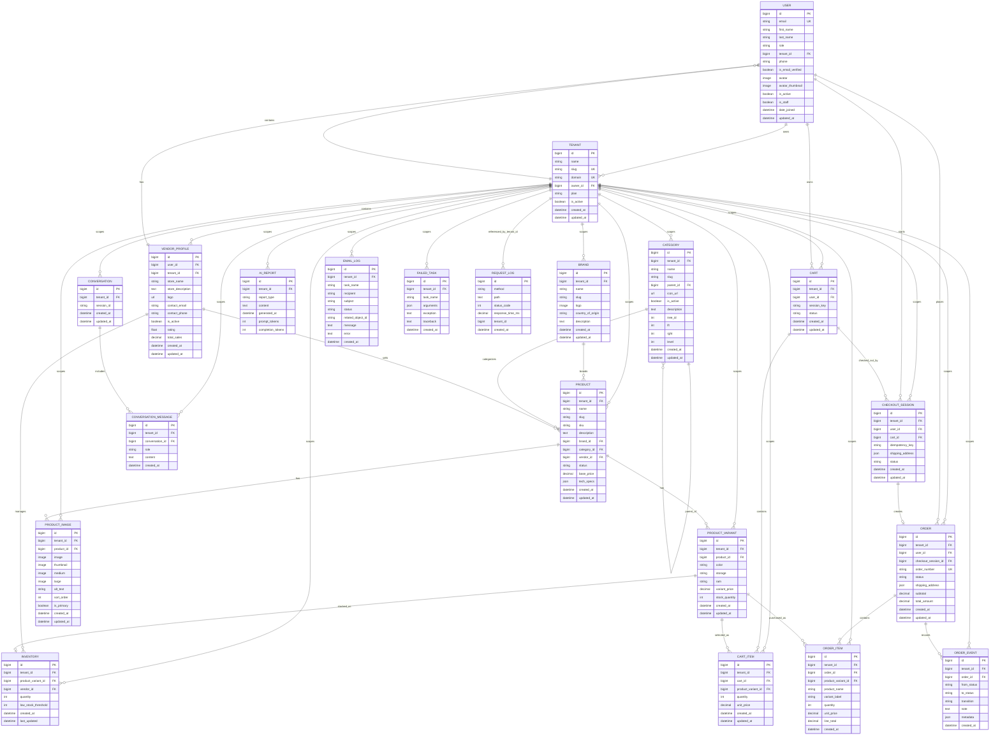

# Entity Relationship Diagram

Task: #410 Create entity-relationship diagram covering all 20+ models.

This document covers the custom application models in the backend. It excludes Django framework tables such as auth groups, sessions, admin logs, and token blacklist tables.

## Model Coverage

The backend currently defines 21 custom application models:

| App | Models |
| --- | --- |
| `tenants` | `Tenant` |
| `users` | `User` |
| `vendor` | `VendorProfile` |
| `catalog` | `Brand`, `Category`, `Product`, `ProductVariant`, `ProductImage` |
| `inventory` | `Inventory` |
| `cart` | `Cart`, `CartItem` |
| `checkout` | `CheckoutSession` |
| `orders` | `Order`, `OrderItem`, `OrderEvent` |
| `ai` | `AIReport`, `Conversation`, `ConversationMessage` |
| `notifications` | `EmailLog`, `FailedTask` |
| `request_logs` | `RequestLog` |

Most business models inherit from `TenantModel`, which adds an optional `tenant_id` foreign key to `Tenant`. `RequestLog.tenant_id` stores the tenant id as a plain indexed integer, not as a database-enforced foreign key.

## ER Diagram

## Relationship Summary

- `Tenant` is the main isolation boundary for users, vendors, catalog data, carts, checkout sessions, orders, AI records, notifications, and failed Celery tasks.
- `User` belongs to one tenant and can also own tenants through `Tenant.owner`.
- `VendorProfile` is one-to-one with `User` and belongs to one tenant.
- `Product` belongs to one `Brand`, one `Category`, and optionally one `VendorProfile`.
- `Category` is hierarchical through its self-referencing `parent` field and django-mptt tree fields.
- `ProductVariant` and `ProductImage` belong to `Product`.
- `Inventory` connects a `VendorProfile` to a `ProductVariant`, with one inventory row per tenant and variant.
- `Cart` belongs to either a user or a guest session key, and `CartItem` connects carts to product variants.
- `CheckoutSession` connects a user and cart before order creation.
- `Order` is created from one checkout session, has many `OrderItem` rows, and records status changes through `OrderEvent`.
- `Conversation` stores chat sessions and owns ordered `ConversationMessage` rows.
- `EmailLog` records transactional email send attempts, while `FailedTask` records exhausted background task failures.
- `RequestLog` stores request telemetry and keeps `tenant_id` as an indexed scalar value instead of an enforced FK.
